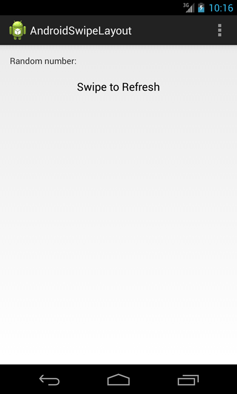

# SwipeRefreshLayout 学习笔记
SwipeRefreshLayout组件是由SDK提供

这个组件被使用时用户可以使用扫动手势刷新UI

SwipeRefreshLayout组件只接受一个子组件：即需要刷新的那个组件。它使用一个侦听机制来通知拥有该组件的监听器有刷新事件发生，换句话说我们的Activity必须实现通知的接口。该Activity负责处理事件刷新和刷新相应的视图。一旦监听者接收到该事件，就决定了刷新过程中应处理的地方。如果要展示一个“刷新动画”，它必须调用setRefrshing（true），否则取消动画就调用setRefreshing（false）。

怎样使用SwipeRefreshLayout

现在我们知道这组件如何工作的，我们将创建一个简单的例子来说明如何使用。假设用户通过使用一个垂直滑动手势来产生一个随机数：


通常来说这是根组件:
```
<android.support.v4.widget.SwipeRefreshLayout
    android:layout_width="match_parent"
    android:layout_height="match_parent"
    xmlns:android="http://schemas.android.com/apk/res/android"
    android:paddingLeft="@dimen/activity_horizontal_margin"
    android:paddingRight="@dimen/activity_horizontal_margin"
    android:paddingTop="@dimen/activity_vertical_margin"
    android:paddingBottom="@dimen/activity_vertical_margin"
    android:id="@+id/swipe">
    <ScrollView
        android:layout_width="match_parent"
        android:layout_height="match_parent">
        <RelativeLayout
            android:layout_width="match_parent"
            android:layout_height="match_parent">
 
            <TextView
                android:layout_width="wrap_content"
                android:layout_height="wrap_content"
                android:text="Random number:"
                android:id="@+id/lbl"/>
 
            <TextView
                android:layout_width="wrap_content"
                android:layout_height="wrap_content"
                android:id="@+id/rndNum"
                android:layout_toRightOf="@id/lbl"/>
 
 
            <TextView
                android:layout_width="wrap_content"
                android:layout_height="wrap_content"
                android:layout_below="@id/lbl"
                android:layout_centerHorizontal="true"
                android:layout_marginTop="20dp"
                android:text="Swipe to Refresh"
                style="@android:style/TextAppearance.Medium"/>
        </RelativeLayout>
    </ScrollView>
</android.support.v4.widget.SwipeRefreshLayout>
```
从上面布局来看，SwipeRefreshLayout只有一个子组件。现在我们来编写Activity:
```
@Override
protected void onCreate(Bundle savedInstanceState) {
    super.onCreate(savedInstanceState);
    setContentView(R.layout.activity_main);
    final SwipeRefreshLayout swipeView = (SwipeRefreshLayout) findViewById(R.id.swipe);
    final TextView rndNum = (TextView) findViewById(R.id.rndNum);
    swipeView.setColorScheme(android.R.color.holo_blue_dark, android.R.color.holo_blue_light, android.R.color.holo_green_light, android.R.color.holo_green_light);
    swipeView.setOnRefreshListener(new SwipeRefreshLayout.OnRefreshListener() {
        @Override
        public void onRefresh() {
            swipeView.setRefreshing(true);
            Log.d("Swipe", "Refreshing Number");
            ( new Handler()).postDelayed(new Runnable() {
                @Override
                public void run() {
                    swipeView.setRefreshing(false);
                    double f = Math.random();
                    rndNum.setText(String.valueOf(f));
                }
            }, 3000);
        }
    });
}
```
正如你在示例中所看到的，事件发生在onCreate方法。在第6行，我们得到SwipeRefreshLayout引用，这样我们就可以设置监听器（10、11、12行）。在监听者这边，我们通过设置setRefreshing（true）动开启刷新画，然后生成随机数。在结束的时候（这里模拟了一个相当漫长的过程）停止动画。

在ListView上使用SwipeRefreshLayout

另一个有趣的例子是在ListView中如何使用SwipeRefreshLayout。这是一个有趣的例子，因为在真正的应用程序中，我们经常会遇到这种情况。我们有一些带ListView的项目，希望对它们刷新。如果ListView是SwipeRefreshLayout唯一的孩子，不会出现任何问题，一切都会运行正常。在某些情况下，不仅有ListView可能还有其他的元素。假设有这样一个界面：


这种情况有些复杂，如果我们向上滚动在ListView中项目，一切都如预期那样显示。但如果向下滚动，刷新过程开始列表项并不滚动。在这种情况下，我们可以使用一个小技巧，可以通过setEnabled（false）禁止使用刷新通知，当Listview中第一个项可见时而再启用它：
```
     @Override
    protected void onCreate(Bundle savedInstanceState) {
        super.onCreate(savedInstanceState);
        setContentView(R.layout.activity_main);
        final SwipeRefreshLayout swipeView = (SwipeRefreshLayout) findViewById(R.id.swipe);
 
        swipeView.setEnabled(false);
        ListView lView = (ListView) findViewById(R.id.list);
        ArrayAdapter adp = new ArrayAdapter(this, android.R.layout.simple_list_item_1, createItems(40,0 ));
        lView.setAdapter(adp);
 
        swipeView.setOnRefreshListener(new SwipeRefreshLayout.OnRefreshListener() {
             @Override
             public void onRefresh() {
                swipeView.setRefreshing(true);
                 ( new Handler()).postDelayed(new Runnable() {
                @Override
                public void run() {
                    swipeView.setRefreshing(false);
 
                }
            }, 3000);
        }
    });
 
        lView.setOnScrollListener(new AbsListView.OnScrollListener() {
            @Override
             public void onScrollStateChanged(AbsListView absListView, int i) {
 
        }
 
            @Override
             public void onScroll(AbsListView absListView, int firstVisibleItem, int visibleItemCount, int totalItemCount) {
                if (firstVisibleItem == 0)
                    swipeView.setEnabled(true);
                else
                    swipeView.setEnabled(false);
        }
    });
}
```
正如第33行public void onScroll(AbsListView absListView, int firstVisibleItem, int visibleItemCount, int totalItemCount)看到的，我们重写了ListView中的onScrollListener去处理启用/禁用机制。
