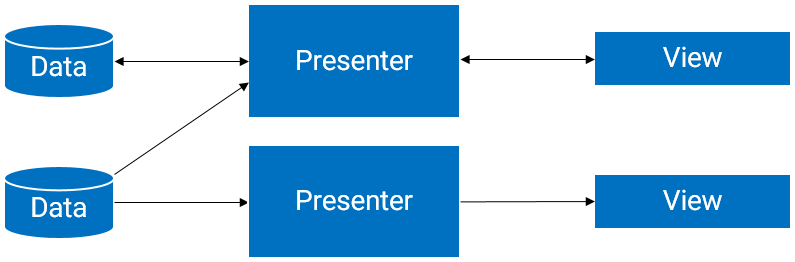
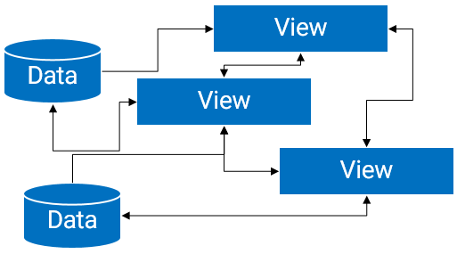
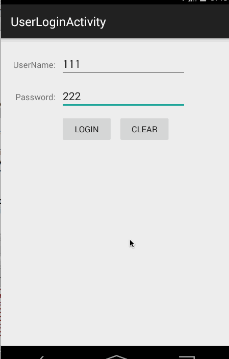
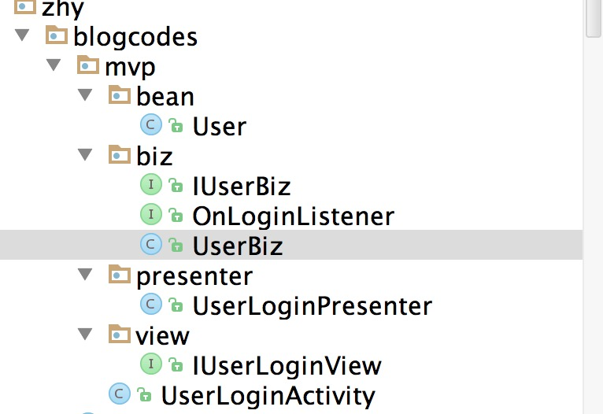

#android mvp

## 一、概述

对于MVP（Model View Presenter），大多数人都能说出一二：“MVC的演化版本”，“让Model和View完全解耦”等等。本篇博文仅是为了做下记录，提出一些自己的看法，和帮助大家如何针对一个Activity页面去编写针对MVP风格的代码。

对于MVP，我的内心有一个问题：

为何这个模式出来后，就能被广大的Android的程序员接受呢？
问了些程序员，他们对于MVP的普遍的认识是：“代码很清晰，不过增加了很多类”。我在第一次看到MVP的时候，看了一个demo，看完以后觉得非常nice（但是回过头来，自己想个例子写，就头疼写不出来，当然这在后文会说）。nice的原因还是因为，这个模式的确让代码的清晰度有了很大的提升。

那么，提升一般都是对比出来的，回顾下，没有应用MVP的代码结构。很多人说明显是MVC么：

View：对应于布局文件
Model：业务逻辑和实体模型
Controllor：对应于Activity
看起来的确像那么回事，但是细细的想想这个View对应于布局文件，其实能做的事情特别少，实际上关于该布局文件中的数据绑定的操作，事件处理的代码都在Activity中，造成了Activity既像View又像Controller（当然了Data-Binder的出现，可能会让View更像View吧）。这可能也就是为何，在该文中有一句这样的话：

Most of the modern Android applications just use View-Model architecture，everything is connected with Activity.
而当将架构改为MVP以后，Presenter的出现，将Actvity视为View层，Presenter负责完成View层与Model层的交互。现在是这样的：

View 对应于Activity，负责View的绘制以及与用户交互
Model 依然是业务逻辑和实体模型
Presenter 负责完成View于Model间的交互
ok，先简单了解下，文中会有例子到时候可以直观的感受下。

小总结下，也就是说，之所以让人觉得耳目一新，是因为这次的跳跃是从并不标准的MVC到MVP的一个转变，减少了Activity的职责，简化了Activity中的代码，将复杂的逻辑代码提取到了Presenter中进行处理。与之对应的好处就是，耦合度更低，更方便的进行测试。借用两张图（出自:该文），代表上述的转变：


转变为：


## 二、MVP 与 MVC 区别

ok，上面说了一堆理论，下面我们还是需要看一看MVC与MVP的一个区别，请看下图（来自：本文）:


其实最明显的区别就是，MVC中是允许Model和View进行交互的，而MVP中很明显，Model与View之间的交互由Presenter完成。还有一点就是Presenter与View之间的交互是通过接口的（代码中会体现)。

还有一堆概念性的东西，以及优点就略了，有兴趣自行百度。下面还是通过一些简单的需求来展示如何编写MVP的demo。

## 三、Simple Login Demo

效果图：

看到这样的效果，先看下完工后的项目结构：

ok，接下来开始一步一步的编写思路。

（一）Model

首先实体类User不用考虑这个肯定有，其次从效果图可以看到至少有一个业务方法login()，这两点没什么难度，我们首先完成：
``` java
package com.zhy.blogcodes.mvp.bean;

/**
 * Created by zhy on 15/6/18.
 */
public class User
{
    private String username ;
    private String password ;

    public String getUsername()
    {
        return username;
    }

    public void setUsername(String username)
    {
        this.username = username;
    }

    public String getPassword()
    {
        return password;
    }

    public void setPassword(String password)
    {
        this.password = password;
    }
}
 

package com.zhy.blogcodes.mvp.biz;

/**
 * Created by zhy on 15/6/19.
 */
public interface IUserBiz
{
    public void login(String username, String password, OnLoginListener loginListener);
}
 

package com.zhy.blogcodes.mvp.biz;

import com.zhy.blogcodes.mvp.bean.User;

/**
 * Created by zhy on 15/6/19.
 */
public class UserBiz implements IUserBiz
{

    @Override
    public void login(final String username, final String password, final OnLoginListener loginListener)
    {
        //模拟子线程耗时操作
        new Thread()
        {
            @Override
            public void run()
            {
                try
                {
                    Thread.sleep(2000);
                } catch (InterruptedException e)
                {
                    e.printStackTrace();
                }
                //模拟登录成功
                if ("zhy".equals(username) && "123".equals(password))
                {
                    User user = new User();
                    user.setUsername(username);
                    user.setPassword(password);
                    loginListener.loginSuccess(user);
                } else
                {
                    loginListener.loginFailed();
                }
            }
        }.start();
    }
 
package com.zhy.blogcodes.mvp.biz;

import com.zhy.blogcodes.mvp.bean.User;

/**
 * Created by zhy on 15/6/19.
 */
public interface OnLoginListener
{
    void loginSuccess(User user);

    void loginFailed();
}
 ```
实体类不用说，至于业务类，我们抽取了一个接口，一个实现类这也很常见~~login方法，一般肯定是连接服务器的，是个耗时操作，所以我们开辟了子线程，Thread.sleep(2000)模拟了耗时，由于是耗时操作，所以我们通过一个回调接口来通知登录的状态。

其实这里还是比较好写的，因为和传统写法没区别。

(二) View

上面我们说过，Presenter与View交互是通过接口。所以我们这里需要定义一个ILoginView，难点就在于应该有哪些方法，我们看一眼效果图：

可以看到我们有两个按钮，一个是login，一个是clear；

login说明了要有用户名、密码，那么对应两个方法：


    String getUserName();

    String getPassword();
 
再者login是个耗时操作，我们需要给用户一个友好的提示，一般就是操作ProgressBar，所以再两个：

    void showLoading();

    void hideLoading();
 
login当然存在登录成功与失败的处理，我们主要看成功我们是跳转Activity，而失败可能是去给个提醒：

    void toMainActivity(User user);

    void showFailedError();
 
ok，login这个方法我们分析完了~~还剩个clear那就简单了：

    void clearUserName();

    void clearPassword();
 
综上，接口完整为：
``` java 
package com.zhy.blogcodes.mvp.view;

import com.zhy.blogcodes.mvp.bean.User;

/**
 * Created by zhy on 15/6/19.
 */
public interface IUserLoginView
{
    String getUserName();

    String getPassword();

    void clearUserName();

    void clearPassword();

    void showLoading();

    void hideLoading();

    void toMainActivity(User user);

    void showFailedError();

}
 ```
有了接口，实现就太好写了~~~

总结下，对于View的接口，去观察功能上的操作，然后考虑：

该操作需要什么？（getUserName, getPassword）
该操作的结果，对应的反馈？(toMainActivity, showFailedError)
该操作过程中对应的友好的交互？(showLoading, hideLoading)
下面贴一下我们的View的实现类，哈，其实就是Activity，文章开始就说过，MVP中的View其实就是Activity。
``` java
package com.zhy.blogcodes.mvp;

import android.os.Bundle;
import android.support.v7.app.ActionBarActivity;
import android.view.View;
import android.widget.Button;
import android.widget.EditText;
import android.widget.ProgressBar;
import android.widget.Toast;

import com.zhy.blogcodes.R;
import com.zhy.blogcodes.mvp.bean.User;
import com.zhy.blogcodes.mvp.presenter.UserLoginPresenter;
import com.zhy.blogcodes.mvp.view.IUserLoginView;

public class UserLoginActivity extends ActionBarActivity implements IUserLoginView
{


    private EditText mEtUsername, mEtPassword;
    private Button mBtnLogin, mBtnClear;
    private ProgressBar mPbLoading;

    private UserLoginPresenter mUserLoginPresenter = new UserLoginPresenter(this);

    @Override
    protected void onCreate(Bundle savedInstanceState)
    {
        super.onCreate(savedInstanceState);
        setContentView(R.layout.activity_user_login);

        initViews();
    }

    private void initViews()
    {
        mEtUsername = (EditText) findViewById(R.id.id_et_username);
        mEtPassword = (EditText) findViewById(R.id.id_et_password);

        mBtnClear = (Button) findViewById(R.id.id_btn_clear);
        mBtnLogin = (Button) findViewById(R.id.id_btn_login);

        mPbLoading = (ProgressBar) findViewById(R.id.id_pb_loading);

        mBtnLogin.setOnClickListener(new View.OnClickListener()
        {
            @Override
            public void onClick(View v)
            {
                mUserLoginPresenter.login();
            }
        });

        mBtnClear.setOnClickListener(new View.OnClickListener()
        {
            @Override
            public void onClick(View v)
            {
                mUserLoginPresenter.clear();
            }
        });
    }


    @Override
    public String getUserName()
    {
        return mEtUsername.getText().toString();
    }

    @Override
    public String getPassword()
    {
        return mEtPassword.getText().toString();
    }

    @Override
    public void clearUserName()
    {
        mEtUsername.setText("");
    }

    @Override
    public void clearPassword()
    {
        mEtPassword.setText("");
    }

    @Override
    public void showLoading()
    {
        mPbLoading.setVisibility(View.VISIBLE);
    }

    @Override
    public void hideLoading()
    {
        mPbLoading.setVisibility(View.GONE);
    }

    @Override
    public void toMainActivity(User user)
    {
        Toast.makeText(this, user.getUsername() +
                " login success , to MainActivity", Toast.LENGTH_SHORT).show();
    }

    @Override
    public void showFailedError()
    {
        Toast.makeText(this,
                "login failed", Toast.LENGTH_SHORT).show();
    }
}
```
对于在Activity中实现我们上述定义的接口，是一件很容易的事，毕竟接口引导我们去完成。

最后看我们的Presenter。

（三）Presenter

Presenter是用作Model和View之间交互的桥梁，那么应该有什么方法呢？

其实也是主要看该功能有什么操作，比如本例，两个操作:login和clear。
``` java
package com.zhy.blogcodes.mvp.presenter;

import android.os.Handler;

import com.zhy.blogcodes.mvp.bean.User;
import com.zhy.blogcodes.mvp.biz.IUserBiz;
import com.zhy.blogcodes.mvp.biz.OnLoginListener;
import com.zhy.blogcodes.mvp.biz.UserBiz;
import com.zhy.blogcodes.mvp.view.IUserLoginView;


/**
 * Created by zhy on 15/6/19.
 */
public class UserLoginPresenter
{
    private IUserBiz userBiz;
    private IUserLoginView userLoginView;
    private Handler mHandler = new Handler();

    public UserLoginPresenter(IUserLoginView userLoginView)
    {
        this.userLoginView = userLoginView;
        this.userBiz = new UserBiz();
    }

    public void login()
    {
        userLoginView.showLoading();
        userBiz.login(userLoginView.getUserName(), userLoginView.getPassword(), new OnLoginListener()
        {
            @Override
            public void loginSuccess(final User user)
            {
                //需要在UI线程执行
                mHandler.post(new Runnable()
                {
                    @Override
                    public void run()
                    {
                        userLoginView.toMainActivity(user);
                        userLoginView.hideLoading();
                    }
                });

            }

            @Override
            public void loginFailed()
            {
                //需要在UI线程执行
                mHandler.post(new Runnable()
                {
                    @Override
                    public void run()
                    {
                        userLoginView.showFailedError();
                        userLoginView.hideLoading();
                    }
                });

            }
        });
    }

    public void clear()
    {
        userLoginView.clearUserName();
        userLoginView.clearPassword();
    }
```
注意上述代码，我们的presenter完成二者的交互，那么肯定需要二者的实现类。大致就是从View中获取需要的参数，交给Model去执行业务方法，执行的过程中需要的反馈，以及结果，再让View进行做对应的显示。
